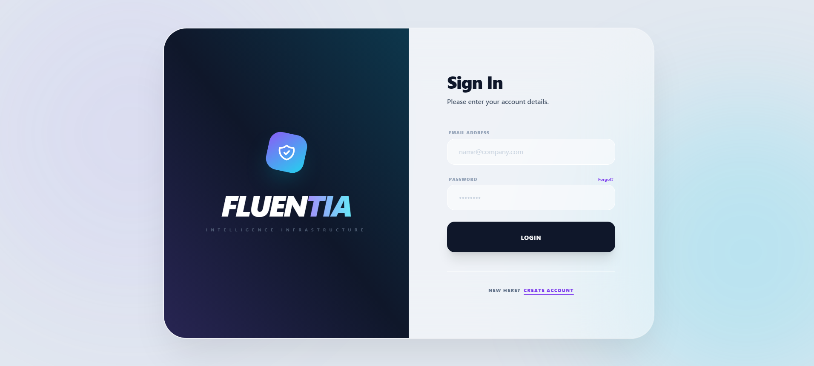
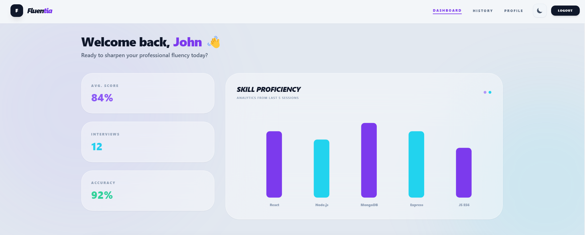
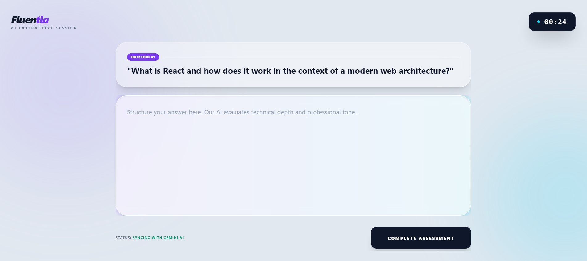
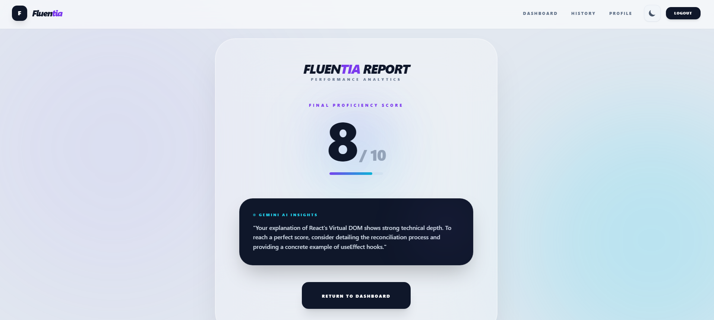

# AI Mock Interview Platform

This is a MERN stack project for practicing interview questions.

## Features
- Login & Register
- Dashboard
- Interview with Timer
- Result with Feedback
- History Page
- Profile Page
- Dark Mode
- Charts

## Tech Stack
Frontend: React, Tailwind CSS  
Backend: Node.js, Express, MongoDB  

## How to Run

Frontend:
cd frontend
npm install
npm run dev

Backend:
cd backend
npm install
npm run dev

## 📸 Screenshots

### Login Page

### Dashboard

### Interview

### Result
